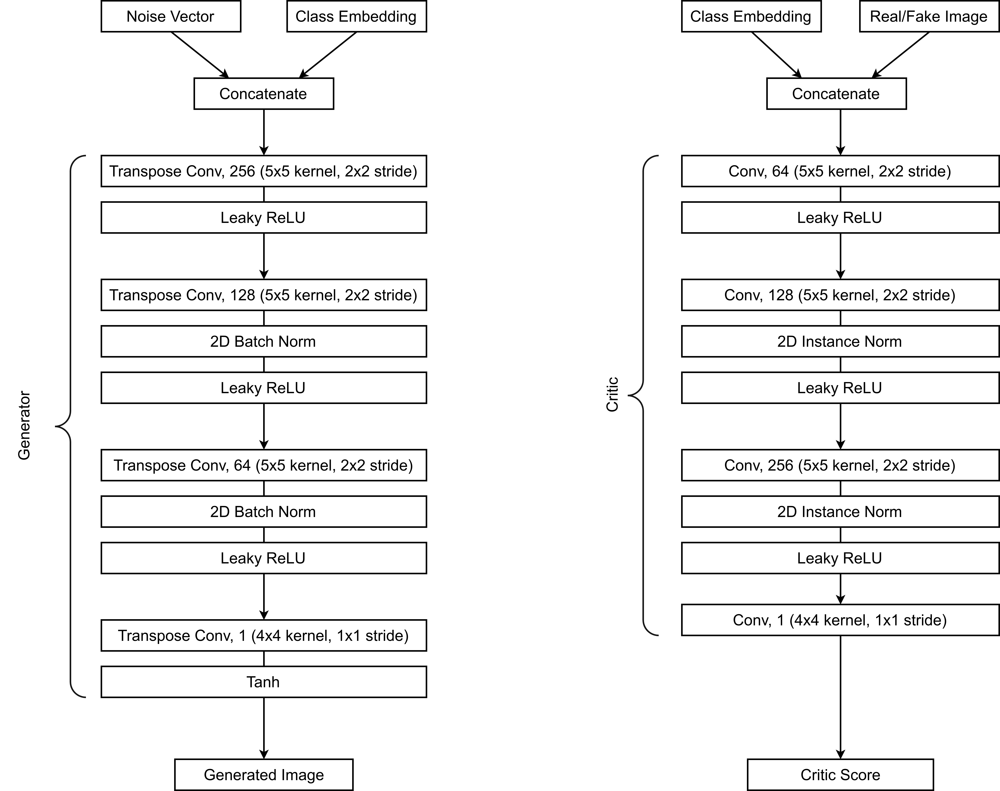
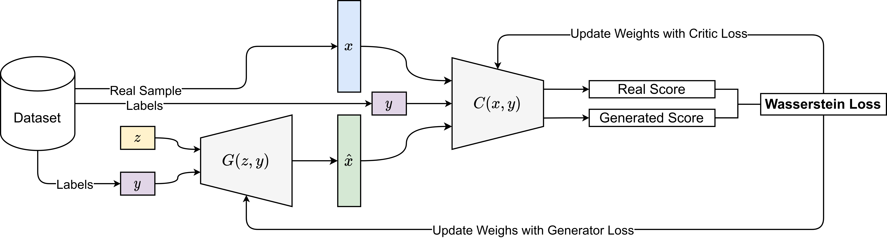
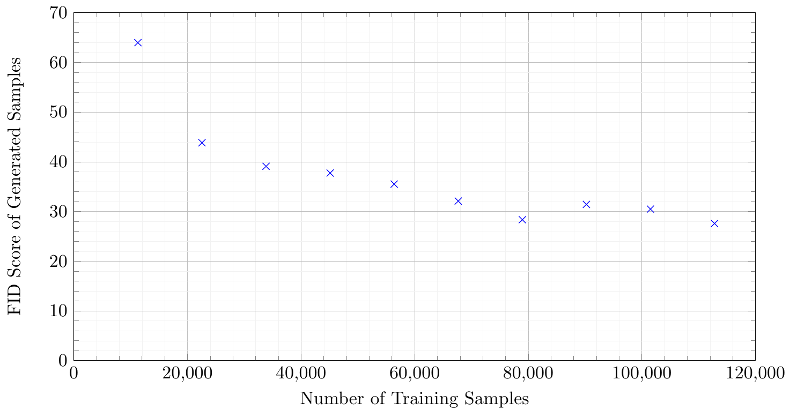
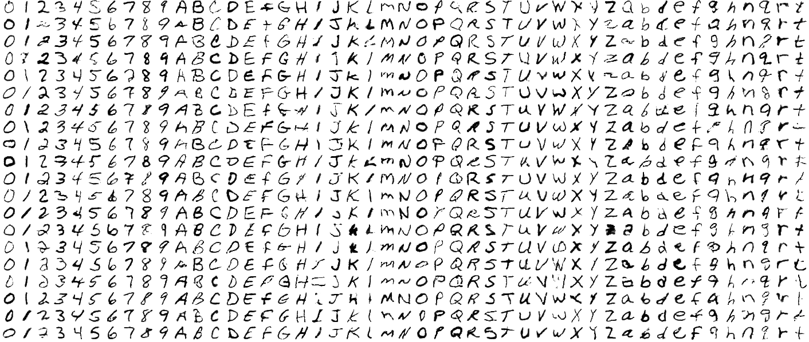
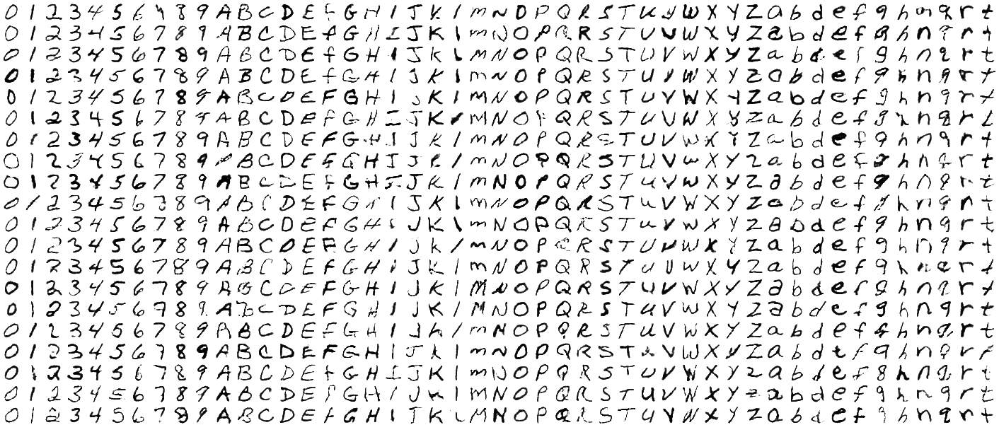

# Wasserstein Conditional Deep-Convolutional GAN with Gradient Penalty

This repository contains the scripts and document for my International
Baccalaureate Extended Essay in Computer Science (which I took at Higher level).
This essay was submitted during the May 2023 examination session and I received
a grade A for it.

In summary, I combined the concepts of a Conditional GAN, a Wasserstein GAN with
gradient penalty, and the Deep Convolutional GAN together to generate images from
the EMNIST dataset that consists of alphanumeric characters. I then investigated
the effect of constricting the training dataset to see how that would impact
the fidelity of the generated images which is quatified by the Fréchet Inception
Distance (FID score).

## Model Architecture (cDCWGAN-gp)
This model was implemented using the Pytorch framework and can be found in
`src/models.py`. The model architecture is illustrated in the diagram below.  

<p align="center"></p>


## Training and Evaluation Procedure
Part I: Training the GAN
1. Train the GAN on 112,800 samples for 15 epochs
2. Once training has completed, save the generator state
3. Repeat step 1-3 for all 10 dataset sizes (replace 112,800 with the appropriate value)

Part II: Gathering FID Scores
1. Load the checkpoint of the GAN trained on 112,800 samples
2. Generate samples using the saved generator
3. Calculate the FID score given the generated samples and real images from the dataset
4. Repeat for all saved generator states

Training this model required powerful hardware, so a cloud virtual machine was used with 8
Intel Xeon E5-2623 v4 cores, 30 GB of RAM, and an Nvidia Quadro P4000 with 8GB of vRAM.
This was able to sufficiently train each model configuration, taking approximately 16 hours to
do so including FID calculation.


The hyperparameters used during the training of this model are shown below. The
python Pytorch script can be found at `src/train.py`.

- $\lambda = 10$ gradient penalty coefficient 
- $n_{\text{critic}}$ ratio of critic to generator training iterations
- $\alpha = 1e-4$ learning rate of optimiser
- $\beta_1 = 0.0$, $\beta_2 = 0.9$ Adam optimiser parameters

<p align="center"></p>

The following loss function was constructed by combining the techniques from each of the papers.
```math
C_{\text{loss}} = \underbrace{C(G(z,y),y) - C(x,y)}_{\text{Wasserstein distance estimate}} +
\underbrace{\lambda(\| \nabla C(\tilde x, y) \|_2 -1)^2}_{\text{Gradient penalty term}}
```

The ‘Wasserstein distance estimate’ remains the same from the original WGAN paper \cite{wgan},
however the generator $G(z,y)$ and critic $C(x,y)$, also take in the labels $y$, since the GAN
is conditional. The next element term is the gradient penalty, which uses the norm of the
gradients of the critic’s weights, when inputting an interpolation of a real and generated image.
The interpolation is done using a random number, $\epsilon\in [0,1]$, resulting in an interpolated
image $\tilde x = \epsilon x + (1-\epsilon)\hat x$, where $x$ and $\hat x$ are real and generated images.

## Results
### Quantitative Data
<div align="center"><table><thead><tr><th>% of Total</th><th>Samples</th><th>FID Score</th><th>$\Delta$ FID</th></tr></thead><tbody><tr><td>10</td><td>11280</td><td>63.9696288</td><td></td></tr><tr><td>20</td><td>22560</td><td>43.81612586</td><td>20.1535</td></tr><tr><td>30</td><td>33840</td><td>39.08653845</td><td>4.729587</td></tr><tr><td>40</td><td>45120</td><td>37.73255476</td><td>1.353984</td></tr><tr><td>50</td><td>56400</td><td>35.50103584</td><td>2.231519</td></tr><tr><td>60</td><td>67680</td><td>32.09195388</td><td>3.409082</td></tr><tr><td>70</td><td>78960</td><td>28.34171738</td><td>3.750237</td></tr><tr><td>80</td><td>90240</td><td>31.41788896</td><td>3.076172</td></tr><tr><td>90</td><td>101520</td><td>30.47313068</td><td>2.891379</td></tr><tr><td>100</td><td>112800</td><td>27.58175179</td><td>2.891379</td></tr></tbody></table></div>

<div align="center"></div>

As is visible in the graph 1, the FID score clearly decreases as the number of training samples
increases (indicating increased fidelity). It is also important to notice that the drop in FID
is significantly higher at lower numbers of training samples, than at higher numbers (between
11,280 and 22,560 FID drops by 20.1 FID points).

### Qualitative Data
#### Full 100% Training Set
<div align="center"></div>

#### Reduced 10% Training Set
<div align="center"></div>

## References
The three repositories I took inpsiration from are listed below and the full list of references can be found in the `references.bib` file. 
- https://github.com/Yangyangii/GAN-Tutorial
- https://github.com/aladdinpersson/Machine-Learning-Collection
- https://github.com/igul222/improved_wgan_training
